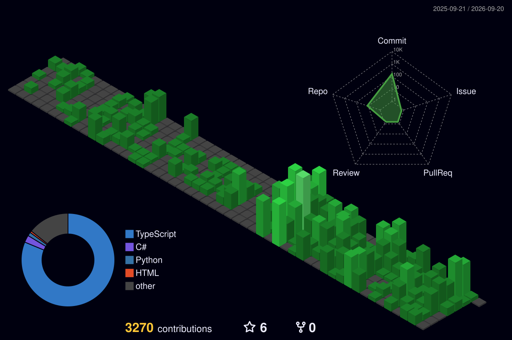

**Laem Chabang, Thailand**

---

I build AI features that fail gracefully and tools small enough to actually finish.
TypeScript and .NET as one stack, not two ecosystems.

---

### Selected work

- **[Prompt Hub](https://github.com/YINDEEINDY/prompt-hub)** — 12 prompt frameworks + 6 advanced techniques, side-by-side. Bilingual, dark-first, editorial typography. · [live](https://prompt-hub-weld-tau.vercel.app)
- **[yin-chat](https://github.com/YINDEEINDY/yin-chat)** — multi-provider AI chat on Next.js 15 + Vercel AI SDK. Streaming, tools, persistent threads.
- **[yin-stack](https://github.com/YINDEEINDY/yin-stack)** — production Next.js 16 starter. TypeScript, Tailwind 4, Drizzle, Sentry, Storybook, Playwright.
- **[FixFlow](https://github.com/YINDEEINDY/fixflow)** — maintenance ticketing for schools. Turns "where's my work order?" into zero emails. · [live](https://fixflow-alpha.vercel.app)
- **[Thai Stock Dashboard](https://github.com/YINDEEINDY/thai-stock-dashboard)** — real-time Thai market data, because the existing dashboards either lag or look like 2008.

---

### By the numbers

<picture>
  <source media="(prefers-color-scheme: dark)" srcset="https://github-profile-summary-cards.vercel.app/api/cards/profile-details?username=YINDEEINDY&theme=github_dark" />
  
</picture>

<picture>
  <source media="(prefers-color-scheme: dark)" srcset="https://github-profile-summary-cards.vercel.app/api/cards/repos-per-language?username=YINDEEINDY&theme=github_dark" />
  
</picture>
<picture>
  <source media="(prefers-color-scheme: dark)" srcset="https://github-profile-summary-cards.vercel.app/api/cards/most-commit-language?username=YINDEEINDY&theme=github_dark" />
  
</picture>

<picture>
  <source media="(prefers-color-scheme: dark)" srcset="https://github-profile-summary-cards.vercel.app/api/cards/stats?username=YINDEEINDY&theme=github_dark" />
  
</picture>
<picture>
  <source media="(prefers-color-scheme: dark)" srcset="https://github-profile-summary-cards.vercel.app/api/cards/productive-time?username=YINDEEINDY&theme=github_dark&utcOffset=7" />
  
</picture>

<picture>
  <source media="(prefers-color-scheme: dark)" srcset="https://streak-stats.demolab.com?user=YINDEEINDY&hide_border=true&theme=tokyonight&background=00000000&ring=6366F1&fire=6366F1&currStreakLabel=6366F1" />
  
</picture>

---

### Contribution activity

<picture>
  <source media="(prefers-color-scheme: dark)" srcset="https://raw.githubusercontent.com/YINDEEINDY/YINDEEINDY/output/github-snake-dark.svg" />
  
</picture>

---

Open to interesting work — **[let's talk →](mailto:yindeehair@gmail.com)**

